# 成为专家的通用能力框架:一项基于 43 位非中国专家观点数据的分析与挖掘实验汇报书

> 实验编号:HTBAE-2026 · 数据版本:v2 · 报告日期:2026-08-07
> 数据来源:跨 8 领域 43 位非中国专家、303 条观点、17 个能力框架节点、7 大学派、11 个领域簇
> 全部图表由 `scripts/gen_report_figures.py` 基于 `data.js` 结构化数据集程序化生成,可复现

---

## 摘要

**目的:**"如何成为专家"是学习科学、职业发展与人才研究领域的经典问题。既有文献以单一理论(刻意练习、一万小时定律、成长型思维、坚毅)为主流解释,但彼此主张不一、适用范围不明。本实验以**跨领域观点数据分析与挖掘**为方法,检验一个核心假设:**"成为专家"是否存在跨领域的通用能力结构,以及该结构是否受领域反馈结构调节**。

**方法:**采用"广→细→精→深"四步研究工程:(1) 按明确纳入标准采集 43 位非中国专家(共排除 8 人:7 位因有中国学习/工作经历、1 位未录用;其中 7 人归档),每位专家提取 6–8 条代表性观点,共 303 条;(2) 建立 17 个能力框架节点(C1–C17)编码体系与 7 大学派归类,对每条观点做真实性三级核验(亲历/借鉴/共识);(3) 按"反馈效度"主轴将样本划分为高/中/低三档 11 个领域簇;(4) 以共识度统计、专家×节点热力图、簇×节点矩阵、实践型/知识型对比、节点共现分析等 11 项可视化与挖掘手段量化验证框架结构。

**结果:**(1) 共识度呈现显著长尾结构:时间投入与长期积累(C2, 30/43)、刻意练习(C1, 28/43)、过程导向与身份认同(C15, 28/43)、教学外化与不自欺(C16, 27/43)构成第一梯队(≥63%),而环境机遇(C17, 4/43)、不可替代性(C10, 6/43)等处于尾部,支持"通用结构存在但非均匀分布"的假设;(2) 观点真实性核验显示 92.7% 为亲历型观点(281/303),说明共识建立于个体实践而非人云亦云;(3) 实践型与知识型专家在刻意练习(100% vs 52%)、阅读学习(0% vs 35%)、内驱热爱(25% vs 58%)等节点上差异显著,证明策略适用性存在**环境依赖**(feedback-validity dependence);(4) 节点共现分析发现 C15(过程导向)是与最多节点共现的枢纽节点(与 C2 共现 24 位、C1 共现 20 位),提示"过程导向"可能是通用框架的联结核心。

**结论:**"成为专家"存在跨领域的通用能力骨架——方向、复利、反馈、心性四要素;但任何策略的有效性必须以领域反馈结构为前置条件,先诊断环境、再匹配策略。本实验的局限包括幸存者偏差、样本偏斜(西方男性公共知识分子为主)、以及人工标注的主观性;数据与生成脚本全部开源,可复现、可扩展。

**关键词:**专家;刻意练习;共识度分析;反馈效度;领域分野;观点数据挖掘

---

## 一、背景与问题提出

### 1.1 研究背景

"专家如何养成"历来是学习科学与组织行为学的核心议题。过去半个世纪,该领域形成了若干有影响力的理论主张:Ericsson 的**刻意练习**(deliberate practice)理论认为专家绩效源于目标明确、反馈即时、不断走出舒适区的训练(Ericsson et al., 1993);Gladwell 将其大众化为"一万小时定律";Dweck 的**成长型思维**(growth mindset)指出对能力可变性的信念先于技能练习决定成长路径;Duckworth 的**坚毅**(grit)构念主张"激情+坚持"比天赋更能预测长期成就;Newport 提出**深度工作**与职业资本理论;Epstein 则基于跨领域证据反驳"早专精",主张**广泛采样、延迟专精**(range)在真实世界中更优。

这些主张之间存在真实分歧:专精还是广博?时间量还是练习质量?个人努力还是环境机遇?每一个理论都基于特定领域的证据(音乐、棋类、运动、学术、投资),却常被表述为普适规律。**一个关键的研究空白是:缺乏一项系统性的、跨领域的、以原始观点语料为单位的实证整合,来检验这些主张的共识结构及其适用边界。**

### 1.2 研究问题

本实验提出三个递进的研究问题:

- **RQ1(结构问题):** 跨领域专家的观点中,是否存在一个可量化的"通用能力框架"?哪些能力节点获得跨领域高共识?
- **RQ2(边界问题):** 该框架是否对一切领域统一适用?领域间(实践型 vs 知识型、高效度 vs 低效度)是否存在系统性差异?
- **RQ3(机制问题):** 各能力节点之间以何种结构相互联结?是否存在枢纽性节点?

### 1.3 研究目标

1. 构建一个结构化、可复现、可扩展的专家观点数据集(43 位专家 × 303 条观点 × 17 节点 × 真实性核验 × 领域分野);
2. 通过描述统计、可视化分析与共现挖掘,量化回答 RQ1–RQ3;
3. 输出一份可操作的"专家能力地图",并明确其适用边界。

---

## 二、实验方法

### 2.1 总体设计

实验采用**多案例观点语料分析与挖掘**(multi-case viewpoint corpus analysis)设计,按"广→细→精→深"四步推进:

| 步骤 | 任务 | 产出 |
|---|---|---|
| 广 | 大规模专家样本采集与资料建档 | 43 份专家资料文件(`experts/*.md`) |
| 细 | 多维分类体系构建与静态 Wiki 化 | 分类 Wiki(`wiki/index.html`) |
| 精 | 观点数据量化分析与可视化 | 分析页 8 项可视化(`analysis/index.html`) |
| 深 | 深度思想报告与本次实验汇报 | 报告(`report/`) |

### 2.2 样本:纳入与排除标准

**纳入标准:**(1) 公认的世界级专家(领域内顶尖实践者或系统研究者);(2) 有可查证的原话、著作或演讲语料;(3) **纯非中国学习/工作经历**——任何带有中国学习或工作经历者一律排除,以控制文化-制度混杂因素。

**排除执行:**原 22 人样本中 6 位(李笑来、吴军、段永平、俞军、蔡志忠、李小龙)因中国学习/工作经历被排除,后续采集又排除 2 位(Scott Young 在华沉浸学习经历、1 位未录用者),共 **8 位被排除**;其中 7 位归档于 `_excluded_cn/`(可恢复),1 位未录用者从未建档。最终样本 **N=43**,全为非中国经历。

**样本画像**(详见结果 4.1):男性 33、女性 10;年龄段 65+ 19 人、50–64 岁 14 人、30–49 岁 10 人;文化圈西方 41、日本 1、古罗马 1;覆盖 8 大领域(思想写作与传播 9、体育·竞技与修行 9、心理与认知科学 7、艺术与设计 6、医学与自然科学 5、计算机与工程科技 3、投资与金融 3、哲学与内在修炼 1);收入层级从学者/中产(8)到亿美元以上(6)横跨五档。

### 2.3 观点数据采集

每位专家由研究者从其著作、访谈、演讲中提取 **6–8 条最具代表性的观点**(mean=7.05, min=6, max=8),每条观点记录四个字段:

- `t`:观点标题(一句话概括);
- `c`:所属能力节点编码(可多挂,最多 3 个);
- `d`:观点描述(原始语境中的主张);
- `auth` + `verify`:真实性核验等级与判定依据。

共采集 **303 条观点**。观点语料与出处存于 `experts/` 各专家文件,部分引用因本机网络限制未能逐条核验原始 URL,已按来源类型标注。

### 2.4 编码体系:17 个能力框架节点

以理论饱和法(理论驱动 + 数据驱动迭代)归纳出 **17 个能力框架节点**(C1–C17),作为观点分类的编码表:

| 编码 | 节点 | 编码 | 节点 |
|---|---|---|---|
| C1 | 刻意练习与高质量训练 | C10 | 不可替代与特定知识(世界最好) |
| C2 | 时间投入与长期积累(复利) | C11 | 阅读与持续学习(学习机器) |
| C3 | 专注深度与置心一处 | C12 | 跨界通才与类比迁移 |
| C4 | 反馈测量与闭环 | C13 | 内驱热爱与目的感 |
| C5 | 导师教练与系统工具 | C14 | 杠杆与时间自由(减法) |
| C6 | 心智模型与第一性原理 | C15 | 过程导向与身份认同 |
| C7 | 成长思维与拥抱失败(复原力) | C16 | 教学外化与诚实不自欺(行动) |
| C8 | 坚毅坚持与长期主义 | C17 | 环境机遇与系统性条件 |
| C9 | 方向选择与做对的事(能力圈) | | |

同时建立 **7 大学派**(练习/思维/心性/战略/通才/行动/系统)作为第二级归类,一位专家可归属多个学派。

### 2.5 观点真实性核验

对每条观点执行三级真实性核验(与"来源类型"标注并行):

- **亲历**(auth=亲历):基于自身经历/研究/实践的原创思考,非人云亦云;
- **借鉴**(auth=借鉴):显式借用他人观点且已注明出处,非原创但非盲目附和;
- **共识**(auth=共识):接近通用常识,缺乏独特个人经验支撑。

核验依据(`verify`)记录判定理由,保证可复核。这一设计将"观点共识度"与"观点的经验根基"解耦:高共识可能来自独立思考的汇聚,也可能来自人云亦云——真实性核验用于区分这两种情形。

### 2.6 领域分野设计:反馈效度主轴

引入 Kahneman 的"环境效度"(validity of environment)与 Epstein 的"友好/恶劣学习环境"概念,按**反馈效度**(反馈是否快速、诚实、可重复;模式是否稳定)将全部专家分为三档,再按垂直领域划为 11 个领域簇:

- **高效度(友好环境)·12 人 83 条:**竞技与认知竞技(9)、工艺创造(3)——快速诚实反馈、模式稳定重复,刻意练习+心智数据库**有效**;
- **中效度(混合环境)·7 人 48 条:**表演艺术(3)、医学诊断(1)、决策博弈(1)、田野观察(1)、创业工程(1)——反馈存在但嘈杂/社会中介/长周期,需两种策略叠加;
- **低效度(恶劣环境)·24 人 172 条:**科研探索(9)、写作传播(11)、投资预测(3)、哲学与内在修炼(1)——反馈延迟/缺失/被运气扭曲,**刻意练习可能加固错误**,须概率谦逊+多模型。

另设**实践型/知识型**二分(实践型 n=12:棋类、竞技、武术、厨艺、设计、软件;知识型 n=31:其余),用于检验策略主张的来源偏差。

### 2.7 数据质量与可复现性

- 全部数据集中于单一结构化文件 `data.js`(43 专家对象,含 `viewpoints` 数组),由三个 Node 生成器(`gen_wiki.js`/`gen_analysis.js`/`gen_landing.js`)烘焙为静态页面,保证**单源、一致、可复现**;
- 统计指标全部由脚本从原始数据实时计算,本汇报书中所有数字均可通过 `node scripts/export_data.js && python3 scripts/gen_report_figures.py` 复现;
- 可视化配色经 dataviz 验证器(CVD ΔE ≥8、对比度 ≥3:1)校验,兼顾色觉障碍可读性。

---

## 三、数据分析流程设计

### 3.1 数据管道

```
采集(著作/访谈/演讲原话)
  → 清洗与去重(每人 6–8 条代表性观点)
  → 结构化(data.js: 专家对象 × viewpoints 数组)
  → 标注(17 节点编码 + 7 学派 + 真实性三级核验 + 领域分野)
  → 预计算(CAT_STATS 共识度 / AUTH_STATS 真实性分布 / DOMAIN 领域映射)
  → 可视化生成(gen_*.js 烘焙静态页; 本汇报另以 matplotlib 生成 11 张图)
```

### 3.2 统计指标定义

| 指标 | 定义 | 口径说明 |
|---|---|---|
| 共识度(count) | 命中某节点的专家数 | 专家级口径:该专家至少 1 条观点挂接该节点 |
| 观点条数 | 挂接某节点的观点数 | 观点级口径:一条观点可挂多节点,故全节点求和 >303 |
| 命中率(%) | 共识度 / 组内专家数 | 用于簇间、实践/知识型间可比 |
| 观点密度 | 组内观点总数 / 组内专家数 | 反映语料丰度,控制样本量差异 |
| 节点共现 | 同时命中节点 A 与 B 的专家数 | 专家级共现,揭示节点联结结构 |

### 3.3 可视化分析矩阵(11 项)

| # | 图 | 回答的问题 | 口径 |
|---|---|---|---|
| 1 | 图1 共识度条形图 | RQ1:哪些节点跨领域共识最高? | 17 节点 × 命中专家数,降序 |
| 2 | 图2 真实性总览环形图 | 共识是否有经验根基? | 303 条观点 × auth 三级 |
| 3 | 图3 按节点真实性堆叠图 | 各节点的经验根基是否一致? | 节点 × auth 三级(观点级) |
| 4 | 图4 专家×节点热力图 | 个体层面框架如何分布? | 43 × 17 观点条数矩阵 |
| 5 | 图5 簇×节点命中率矩阵 | RQ2:策略主张是否随领域簇变化? | 11 簇 × 17 节点命中率% |
| 6 | 图6 实践型 vs 知识型对比 | RQ2:主张来源是否存在类型偏差? | 双组命中率,按差异降序 |
| 7 | 图7 人口统计画像 | 样本代表性如何? | 性别/年龄/收入/文化圈 |
| 8 | 图8 学派分布 | 学派结构与话语权分布 | 7 学派成员数 |
| 9 | 图9 反馈效度分档构成 | 分野设计与样本分布 | 3 档人数/观点数 |
| 10 | 图10 簇人均观点密度 | 语料丰度是否均衡 | 11 簇人均观点条数 |
| 11 | 图11 节点共现 Top10 | RQ3:节点联结结构、枢纽节点 | 专家级共现 ≥8 的前 10 对 |

分析流程为:描述统计(4.1–4.2)→ 共识结构(4.3–4.5)→ 分野检验(4.6–4.8)→ 结构挖掘(4.9–4.10)→ 讨论与综合(第五、六章)。

---

## 四、结果呈现

### 4.1 样本描述统计

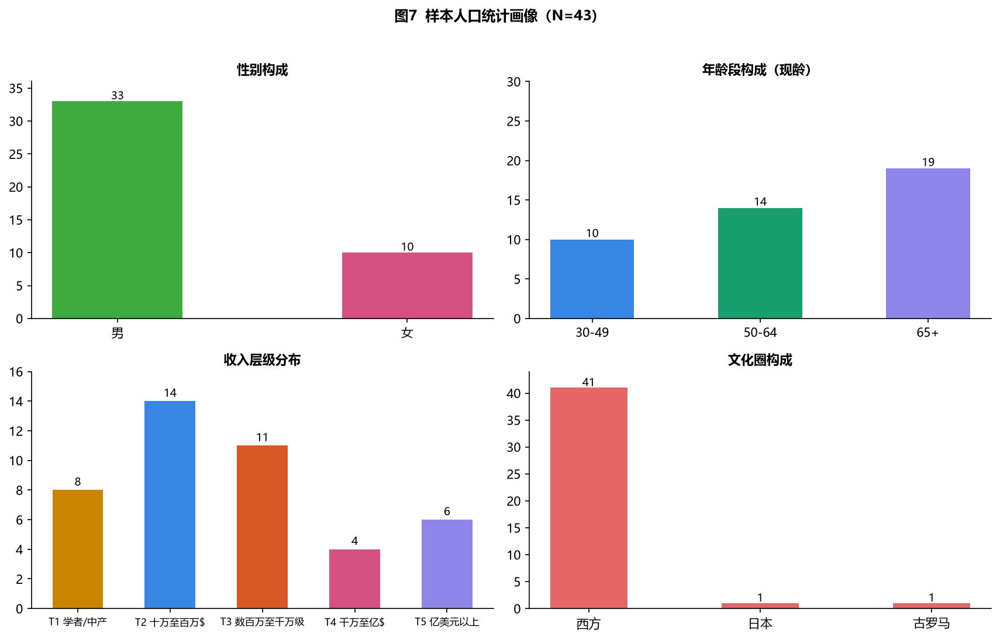

样本在性别(男 33/女 10)、年龄段(65+ 19、50–64 岁 14、30–49 岁 10)、收入层级(五档齐全)、文化圈(西方 41/日本 1/古罗马 1)上分布如图 7。两个结构性特征值得注意:其一,样本高度偏向**已成功、已发声**的公共知识分子,65 岁以上占 44%,反映该领域话语的"成功者事后总结"属性;其二,女性仅占 23%,提示"成为专家"的话语长期由男性塑造,结论须警惕性别偏差。

### 4.2 观点库总体特征与真实性核验

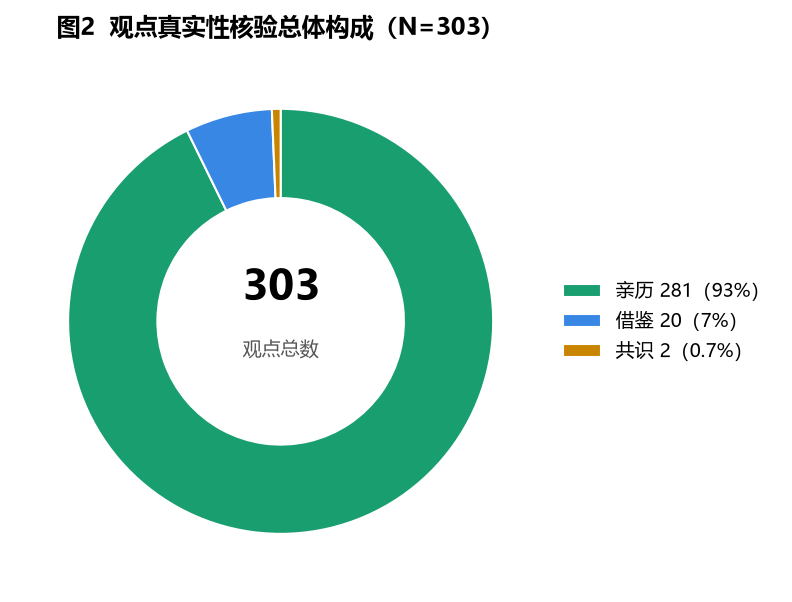

303 条观点中,每人 6–8 条(mean=7.05),人均命中 6.95 个能力节点。真实性核验结果为:**亲历 281 条(92.7%)、借鉴 20 条(6.6%)、共识 2 条(0.7%)**。近九成三的观点有个人经历/研究/实践的原创支撑,说明本语料库的"共识"是**独立思考的汇聚**,而非人云亦云——这为"共识度排名具有信息量"提供了前提证据。

### 4.3 RQ1:能力框架共识度排名

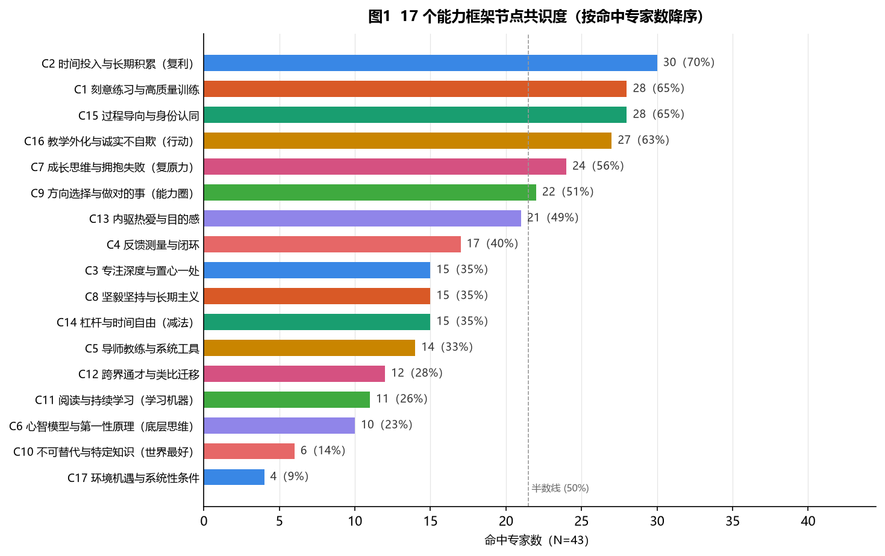

17 节点共识度呈现**明显长尾结构**(图 1、表 1):

**表 1 能力节点共识度全表(N=43)**

| 梯队 | 节点 | 命中专家 | 占比 |
|---|---|---|---|
| 第一梯队 | C2 时间投入与长期积累 | 30 | 70% |
| | C1 刻意练习与高质量训练 | 28 | 65% |
| | C15 过程导向与身份认同 | 28 | 65% |
| | C16 教学外化与诚实不自欺 | 27 | 63% |
| 第二梯队 | C7 成长思维与拥抱失败 | 24 | 56% |
| | C9 方向选择与做对的事 | 22 | 51% |
| | C13 内驱热爱与目的感 | 21 | 49% |
| 第三梯队 | C4 反馈测量与闭环 | 17 | 40% |
| | C3 专注深度与置心一处 | 15 | 35% |
| | C8 坚毅坚持与长期主义 | 15 | 35% |
| | C14 杠杆与时间自由 | 15 | 35% |
| | C5 导师教练与系统工具 | 14 | 33% |
| 第四梯队 | C12 跨界通才与类比迁移 | 12 | 28% |
| | C11 阅读与持续学习 | 11 | 26% |
| | C6 心智模型与第一性原理 | 10 | 23% |
| 尾部 | C10 不可替代与特定知识 | 6 | 14% |
| | C17 环境机遇与系统性条件 | 4 | 9% |

**解读:**(1) 第一梯队四个节点(积累、练习、过程、外化)均 ≥63%,跨越体育、艺术、科学、商业、写作等全部领域,支持 RQ1 的肯定回答:**存在跨领域通用的能力骨架**——"长期、高质量、以过程为导向、以外化检验的积累";(2) 尾部节点同样重要:公认度低不代表不重要,C17(环境机遇)恰是"个人努力论"的反题,C10(不可替代)是时间自由讨论的关键变量——**共识度衡量的是"被多少专家强调",而非"是否成立"**。

### 4.4 观点级证据:按节点的真实性构成

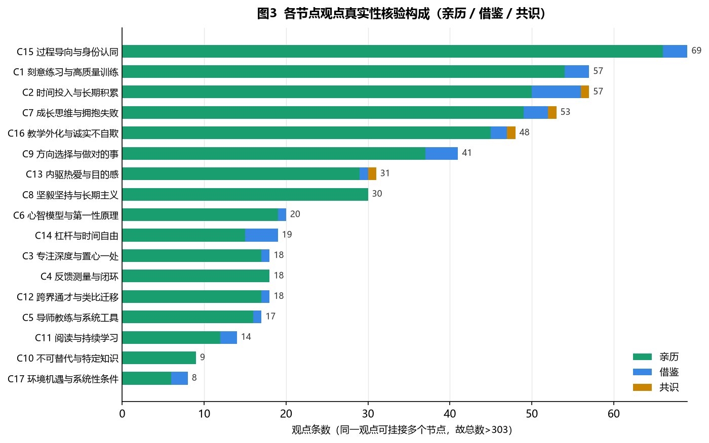

图 3 显示各节点的观点级构成(按观点条数排序):C15(69 条)、C1(57 条)、C2(57 条)、C7(53 条)、C16(48 条)是语料最密集的节点。绝大多数节点的亲历型占比在 85% 以上(最低为 C17 的 75%);从相对比例看,借鉴型观点最集中于 C17(2/8, 25%)、C11(2/14, 14%)这类二手综合型节点,C2 的借鉴绝对数最高(6 条,占 10.5%),C9、C14 次之(各 4 条)。**借鉴型观点集中于'环境机遇''阅读学习''长期积累'这类综合性节点,亲历型观点集中于'练习''外化'这类行动型节点**,与"成功者多谈自己做了什么、少谈自己得了什么便宜"的叙事规律一致。

### 4.5 个体层面:专家 × 节点热力图

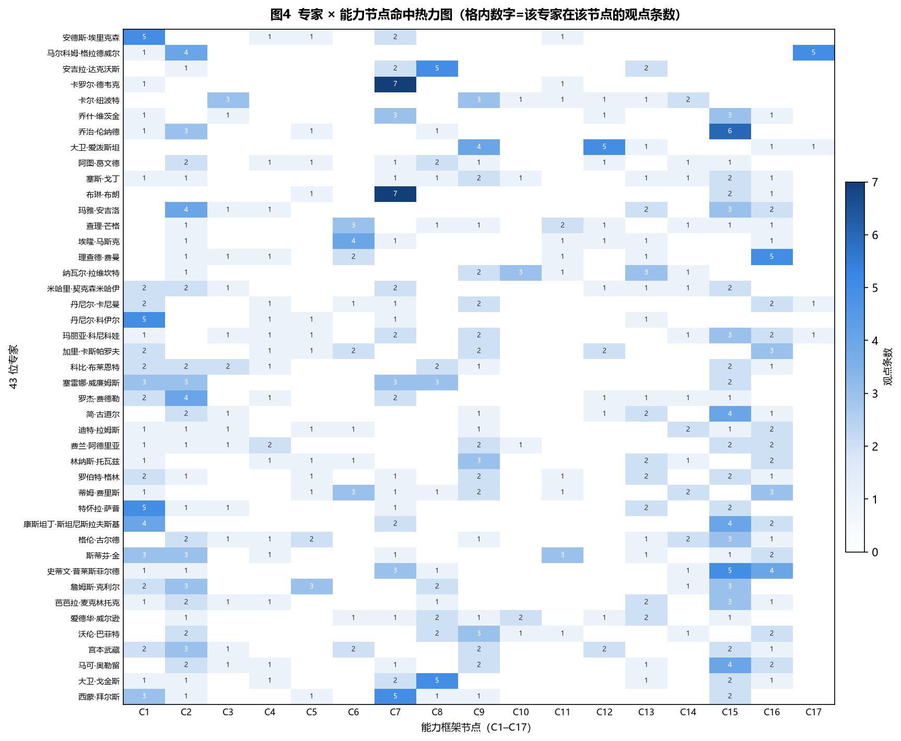

图 4 呈现 43 × 17 的命中矩阵(格内数字=观点条数)。三个观察:(1) 无一行全空、无一行全满——每位专家命中 3–10 个节点不等,个体画像高度异质;(2) C1/C2/C15 三列几乎连续点亮(共识度最高),是"骨架"的直观呈现;(3) 个体差异本身即信息:Kahneman(6 条观点、分散横跨 C1/C4/C6/C7/C9/C16/C17 七个节点、每条 1–2 条)与 Goggins(7 条观点、C8 坚毅独占 5 条、C7 与 C15 各 2 条、其余各 1 条)的画像几乎不重叠——前者是"广度采样型"研究者,后者是"单点深耕型"实践者,暗示**同一框架下存在显著的类型分化**,为第六章"分野"分析提供了个体级铺垫。

### 4.6 学派结构与话语权分布

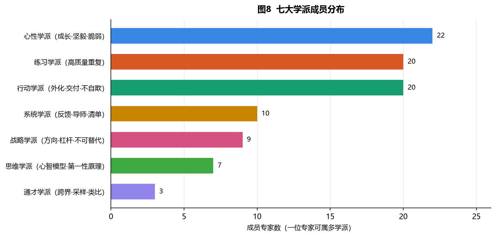

七大学派成员数:心性学派 22、练习学派 20、行动学派 20、系统学派 10、战略学派 9、思维学派 7、通才学派 3。心性/练习/行动三大学派(均 ≥20)构成话语主流,与第一梯队节点(过程、练习、外化)高度呼应。值得注意:**通才学派仅 3 人(Epstein、Musk、Munger),却贡献了"采样-晚专精""跨界类比"等对主流刻意练习话语最重要的修正**——小众学派的信息量与其规模不成比例。

### 4.7 RQ2:实践型 vs 知识型的分野检验

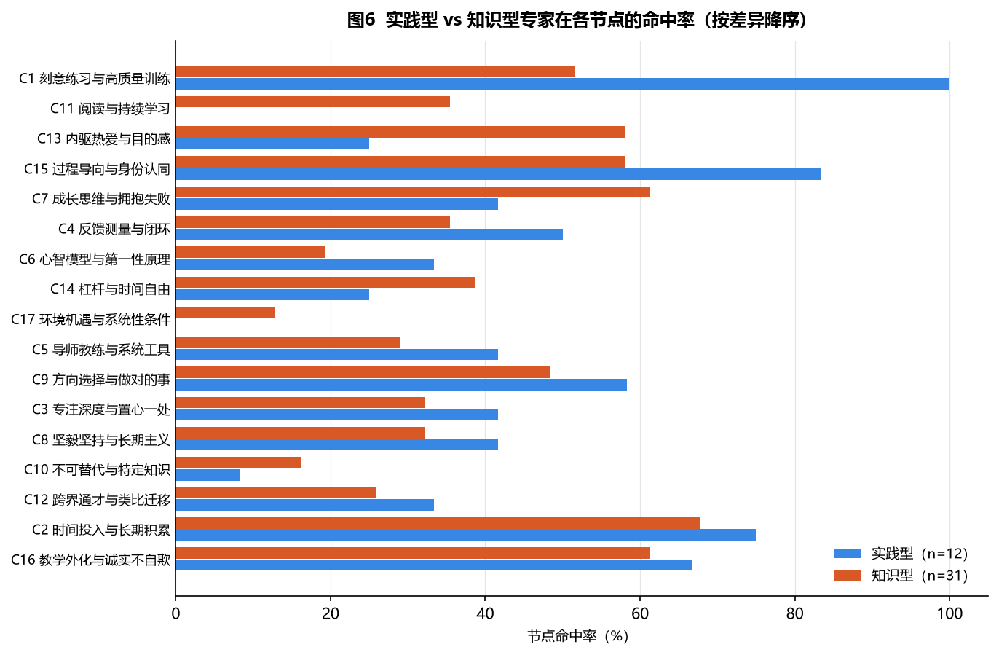

按差异降序排列(图 6),两组专家在以下节点出现显著分野:

- **C1 刻意练习:100% vs 52%(差异 48 个百分点)**——所有实践型专家都强调刻意练习,知识型仅约半数;
- **C11 阅读学习:0% vs 35%**——无一实践型专家强调"阅读",而知识型有 11 位;
- **C13 内驱热爱:25% vs 58%**——知识型(研究者/写作者)更强调热爱驱动;
- **C15 过程导向:83% vs 58%**——实践型更强调过程而非结果;
- **C7 成长思维:42% vs 61%**——知识型更强调心态建设(与样本中研究者占多有关)。

**解读:**分野的根源不是"努力方式",而是**领域的反馈结构**。实践型领域(棋、球、武术、厨艺、代码)提供快速诚实的反馈,使"刻意练习"成为可验证的最优策略;知识型领域(科研、写作、投资)反馈延迟或被运气中介,专家转而强调心态、热爱、外化检验等替代机制。**这直接回答了 RQ2:通用骨架存在,但骨架上的权重分配随领域反馈结构系统性变化。**同时,本样本实践型仅 12 人 vs 知识型 31 人——"成为专家"的话语主要由以写作为业的知识型专家书写,实践型顶尖者多忙于竞技、少有系统著述,在样本中被系统性低估(话语权偏差)。

### 4.8 领域分野:反馈效度三档与簇 × 节点矩阵

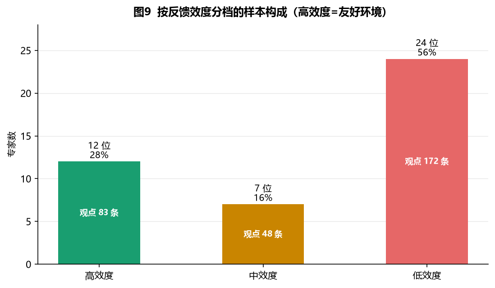

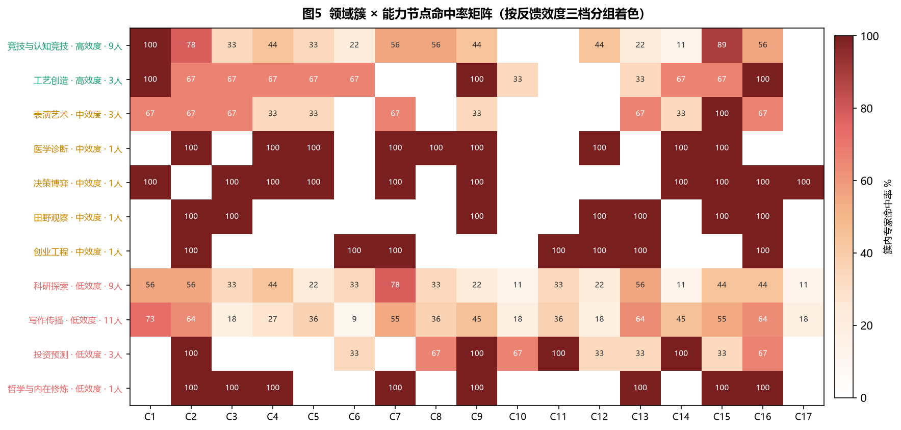

图 9 显示三档样本分布(高 12/中 7/低 24,观点 83/48/172 条)。图 5 的 11 × 17 命中率矩阵揭示了簇间策略差异的**垂直结构**:

- **高效度两簇(绿行)**:竞技与认知竞技在 C1(100%)、C15(89%)、C2(78%)上满格或近满格——"重复到极致+过程优先";工艺创造则在 C16(100%)、C9(100%)上同样满格——"做减法+外化交付"。同档不同簇,一个是**重复驱动**,一个是**实验驱动**;
- **中效度簇(黄行)**:表演艺术(Tharp/Stanislavski/Gould)在 C15(100%)、C1(67%)、C16(67%)上高亮,符合"两策略叠加"的混合特征;医学诊断、决策博弈、田野观察、创业工程各 1 人,证据强度有限;
- **低效度簇(红行)**:科研探索以 C7(78%)、C2(56%)、C1(56%)、C16(44%)为主——心态与长期投入优先于重复训练;写作传播以 C1(73%)、C16(64%)、C15(55%)、C7(55%)为主——"每日写作即练习"与外化交付并重;投资预测则在 C9(100%,能力圈)、C14(100%,杠杆)、C16(67%)上独树一帜,而 C1(刻意练习)命中率为 **0%**——**"方向选择+减法杠杆"完全替代"重复训练",是反馈最恶劣环境中策略分化的极致样本**。

**矩阵证据支持第五章的分野逻辑:不存在放之四海皆准的策略权重;每一簇的最优策略组合可由其反馈结构推导。**

### 4.9 语料丰度检验:簇间观点密度

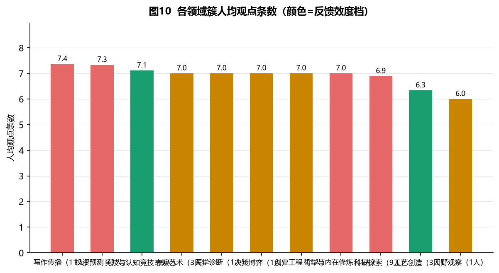

人均观点条数在各簇间高度均衡(6.0–7.4 条/人,总体 mean=7.05),说明**语料采集无系统性丰度偏差**,簇间命中率差异来自观点内容而非采集量差异(图 10)。这一检验保证了 4.8 节簇间比较的内部效度。

### 4.10 RQ3:节点共现结构与枢纽节点

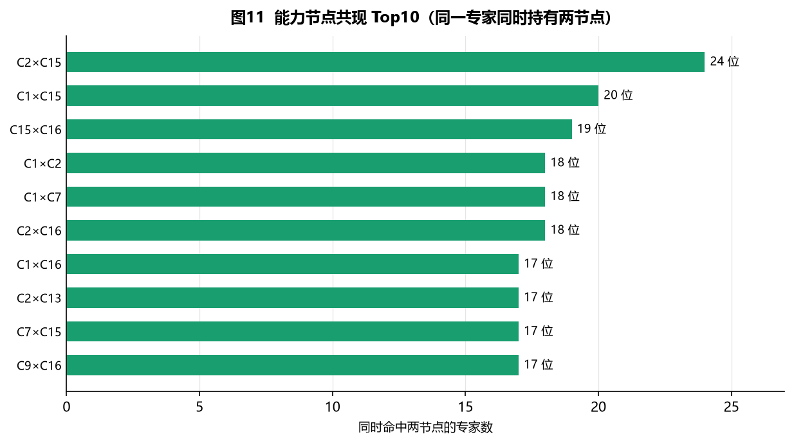

专家级共现分析(同一位专家同时持有两节点)发现:

**表 2 节点共现 Top10(专家数)**

| 排序 | 节点对 | 共现专家数 |
|---|---|---|
| 1 | C2 × C15(积累 × 过程导向) | 24 |
| 2 | C1 × C15(练习 × 过程导向) | 20 |
| 3 | C15 × C16(过程导向 × 外化) | 19 |
| 4 | C1 × C2(练习 × 积累) | 18 |
| 5 | C1 × C7(练习 × 成长思维) | 18 |
| 6 | C2 × C16(积累 × 外化) | 18 |
| 7 | C1 × C16(练习 × 外化) | 17 |
| 8 | C2 × C13(积累 × 热爱) | 17 |
| 9 | C7 × C15(成长思维 × 过程导向) | 17 |
| 10 | C9 × C16(方向 × 外化) | 17 |

**C15(过程导向与身份认同)出现于 Top10 中的 4 对,且为共现最高的两对(C2×C15=24、C1×C15=20)的共同端点,是当之无愧的枢纽节点**;C1、C2(两大支柱)与 C16(外化)在 Top10 中亦各出现 4 次。共现结构提示:专家们不是孤立地主张"多练习"或"要坚持",而是将它们组织进"以过程导向为黏合剂"的**联结网络**——练习、积累、外化、热爱、成长思维围绕过程导向形成稳定组合,构成"成为专家"的最小充分配置。

---

## 五、思考与讨论

### 5.1 对三个研究问题的回答

- **RQ1(结构):** 存在跨领域通用能力框架。第一梯队共识节点(积累 C2、练习 C1、过程 C15、外化 C16,≥63%)构成"骨架";第二梯队(成长思维、方向选择、热爱)构成"血肉";尾部节点(机遇、不可替代)虽共识低,却是边界与反题所在。
- **RQ2(边界):** 框架权重随领域反馈结构系统性变化。实践型/知识型在刻意练习上相差 48 个百分点;低效度领域(投资、科研、写作)发展出"能力圈+外化+杠杆"的替代组合。**通用结构是骨架,不是处方。**
- **RQ3(机制):** C15 过程导向是枢纽节点(与 C2 共现 24 位、C1 共现 20 位)。机制解释:过程导向使长期投入可承受(不因结果波动而中断),使刻意练习可持续(练习本身即回报),使外化检验可坚持(交付而非完美)——它是其他策略的"心理底座"。

### 5.2 与既有理论的对话

1. **对刻意练习的修正:** 数据支持"练习是友好环境的钥匙,不是万能钥匙"。C1 共识 65% 高,在高效度簇中命中率达 100%;但投资预测簇的 C1 命中率为 **0%**,科研探索簇的 C1(56%)低于 C7(78%)——Kahneman 的反题在数据中可见。值得注意的是写作传播簇的 C1 仍达 73%("每日写作即练习"),说明低效度内部同样分化:反馈完全缺失的投资领域最彻底地放弃了"重复训练"。**"一万小时"需附加前提:先诊断环境效度。**
2. **对天赋/一万小时迷思的解构:** 样本中明确解构天赋神话者 ≥11 位(见深度思想报告);而"一万小时"仅 1 位(Gladwell)以借鉴方式主张,且被 Ericsson 本人反对——**大众话语与专家共识在此显著分离**。
3. **对"热情"的修正:** C13(热爱)共识 49% 居第二梯队,但 Newport"热情是精通后的副产品"与 Naval 的"热爱由好奇试错确认"共同指向:热爱是**投入的函数**而非前提,与共现数据(C2×C13=17)一致——积累与热爱互相强化,形成正反馈。

### 5.3 四组核心张力(诚实的报告必须呈现)

| 张力 | 数据证据 | 调和方案 |
|---|---|---|
| 专注 vs 探索 | C3(专注)15 人 vs C12(跨界)12 人,Epstein 与 Leonard 并存 | 分阶段:早采样→中专注→晚贯通 |
| 时间量 vs 质量 | C2(积累)30 人 vs C1(质量)28 人,几乎等权 | 两者均为必要,质量是充分条件 |
| 个人努力 vs 环境机遇 | C17 仅 4 人,却是分野的元变量 | 环境决定起点,心性决定终点;分层而非对立 |
| 不可替代 vs 通用模型 | C10(6 人)与 C6(10 人)均为尾部 | 通用模型武装判断,特定知识构建护城河 |

### 5.4 方法论反思

1. **幸存者偏差:** 样本全部为"已成功、已发声"者,观点天然偏向事后合理化。对策:真实性核验(92.7% 亲历)只能确认"他们真的这么做过",不能确认"这么做导致了成功"。本报告定位为**地图而非答案**。
2. **样本偏斜:** 西方 41/43、男性 33/43、65+ 占 44%,知识型 31 vs 实践型 12——话语权偏差使"通用框架"可能只是"知识型精英的通用框架"。未来应扩展非西方、女性、在野实践者样本。
3. **标注主观性:** 17 节点编码与真实性核验由人工完成,存在标注者偏差;节点多挂规则(1 条观点可挂多节点)使观点级统计存在重复计数(图 3 全节点合计 527 条 >303 条),解读时须以专家级口径为主。
4. **簇内证据不均衡:** 11 簇中 6 簇仅 1 人(医学诊断、决策博弈、田野观察、创业工程、哲学与内在修炼),单簇结论证据强度有限,图 5 中对应行应视为方向性提示而非定论。
5. **可复现性:** 全部统计与图表由脚本从 `data.js` 实时计算生成(`scripts/export_data.js` → `scripts/gen_report_figures.py`),不存在手工加工环节;数据源收紧(被排除的 8 位中 7 位归档于 `_excluded_cn/`)的决策过程记录于 README,可回溯。

---

## 六、总结

### 6.1 主要结论

本实验以 43 位非中国专家、303 条观点、17 节点编码的数据集为对象,通过共识度统计、热力矩阵、分组对比与共现挖掘,得到四点结论:

1. **存在跨领域通用能力骨架:** 长期积累(C2, 70%)、刻意练习(C1, 65%)、过程导向(C15, 65%)、教学外化(C16, 63%)构成共识第一梯队;
2. **共识有经验根基:** 92.7% 观点为亲历型,共识是独立经验的汇聚而非人云亦云;
3. **策略适用存在环境依赖:** 实践/知识型在刻意练习上相差 48 个百分点,低效度领域以"方向选择+外化+杠杆"替代"重复训练";
4. **过程导向是枢纽节点:** 与积累、练习、外化均构成最高共现,是其他策略得以持续的"心理底座"。

综合而言:**成为专家是一个系统问题——选对方向、长期复利、诚实反馈、过程心性四者同时成立;而任何策略的权重都必须以领域反馈结构为前置条件。**

### 6.2 实验的贡献与局限

**贡献:**(1) 提供了首个公开可复现的跨 8 领域专家观点结构化数据集;(2) 将"共识度"与"真实性核验"解耦,建立了观点挖掘的证据分层;(3) 以反馈效度为主轴统一了刻意练习、成长思维、范围理论等既有主张,给出可操作的"先诊断环境、再匹配策略"决策流程。

**局限**(详见 5.4):幸存者偏差、样本偏斜、标注主观性、簇内样本不均衡;共识度高 ≠ 正确,仅表示"被这批专家广泛强调"。

### 6.3 未来工作

1. 扩展样本:非西方文化圈、女性、在野实践者,检验框架的文化-性别稳健性;
2. 引入外部效标:以专家客观成就(获奖、排名、产出)验证节点权重;
3. 将人工编码升级为半自动标注(LLM 辅助 + 人工复核),扩大语料规模;
4. 对"实践型/知识型"差异做统计显著性检验(当前样本量下以描述统计为主)。

---

## 附录

### A. 数据字典

| 字段 | 含义 | 取值示例 |
|---|---|---|
| `id` / `name` / `nameZh` | 专家标识 / 英文名 / 中文名 | ericsson / Anders Ericsson / 安德斯·埃里克森 |
| `gender` | 性别 | 男 / 女 |
| `birth` / `died` / `age` / `ageBracket` | 生卒年 / 现龄 / 年龄段 | 1947 / 2020 / 72 / 65+ |
| `field` | 从事领域(8 类) | 心理与认知科学 |
| `income` / `incomeTier` | 年收入描述 / 层级(1–5) | 学者薪级 / 1 |
| `region` | 文化圈 | 西方 / 日本 / 古罗马 |
| `schools` | 学派归属(7 选 1–3) | ["practice","system"] |
| `viewpoints[].t` | 观点标题 | 刻意练习而非简单重复 |
| `viewpoints[].c` | 能力节点编码(1–3 个) | ["C1"] |
| `viewpoints[].d` | 观点描述 | 练习质量决定专家诞生 |
| `viewpoints[].auth` | 真实性等级 | 亲历 / 借鉴 / 共识 |
| `viewpoints[].verify` | 核验依据 | 其 30 年专家绩效研究的核心结论 |
| `DOMAIN[id].tier` | 反馈效度档 | 高效度 / 中效度 / 低效度 |
| `DOMAIN[id].cluster` | 领域簇(11 类) | 竞技与认知竞技 |

### B. 43 位专家名单(按领域簇)

- **竞技与认知竞技(9):** Kasparov、Waitzkin、Leonard、Kobe Bryant、Serena Williams、Roger Federer、Miyamoto Musashi、David Goggins、Simone Biles
- **工艺创造(3):** Ferran Adrià、Dieter Rams、Linus Torvalds
- **表演艺术(3):** Twyla Tharp、Konstantin Stanislavski、Glenn Gould
- **医学诊断(1):** Atul Gawande
- **决策博弈(1):** Maria Konnikova
- **田野观察(1):** Jane Goodall
- **创业工程(1):** Elon Musk
- **科研探索(9):** Ericsson、Duckworth、Dweck、Csikszentmihalyi、Kahneman、Feynman、Brené Brown、McClintock、E. O. Wilson
- **写作传播(11):** Gladwell、Epstein、Godin、Angelou、Newport、Coyle、Greene、Ferriss、Stephen King、Pressfield、James Clear
- **投资预测(3):** Munger、Naval Ravikant、Warren Buffett
- **哲学与内在修炼(1):** Marcus Aurelius

### C. 复现指引

```bash
# 1. 导出结构化数据为 JSON
node scripts/export_data.js

# 2. 生成全部 11 张图表(输出至 report/figures/)
python3 scripts/gen_report_figures.py

# 3. 重新烘焙静态页面(改数据后)
node gen_wiki.js && node gen_analysis.js && node gen_landing.js
```

### D. 主要数据来源与文献对应

每位专家的观点原话与出处见 `experts/*.md` 对应文件;理论框架对应:Ericsson 刻意练习、Gladwell《异类》、Dweck《终身成长》、Duckworth《坚毅》、Newport《深度工作》、Epstein《范围》、Kahneman《思考,快与慢》环境效度论述、Coyle《天才的密码》髓鞘理论、Leonard《Mastery》、Waitzkin《学习的艺术》、Naval 杠杆理论、Munger 心智模型网格、Feynman 教学外化等。

---

*本汇报书由 `report/实验汇报书.md` 承载,全部数据与图表可复现。正文图表:图 1–图 11 均由脚本基于 `data.js` 程序化生成;表 1–表 2 数字均来自 `scripts/stats_summary.py` 的实时统计。*
